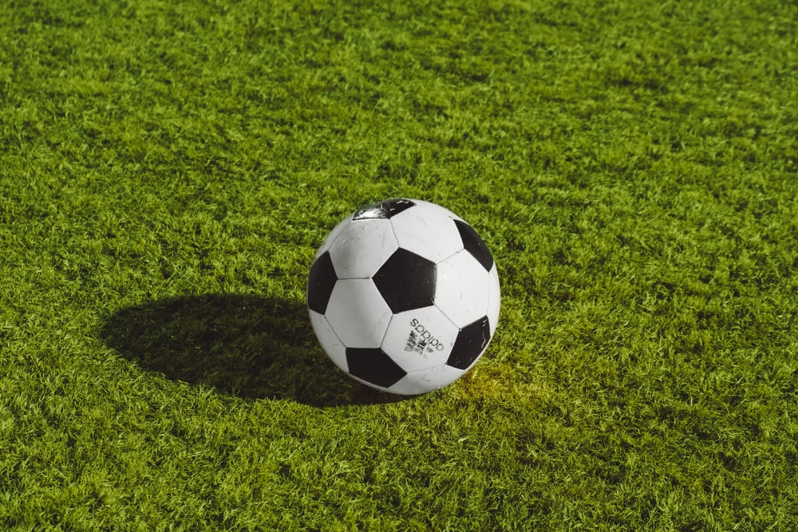
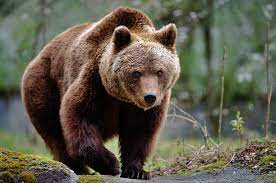
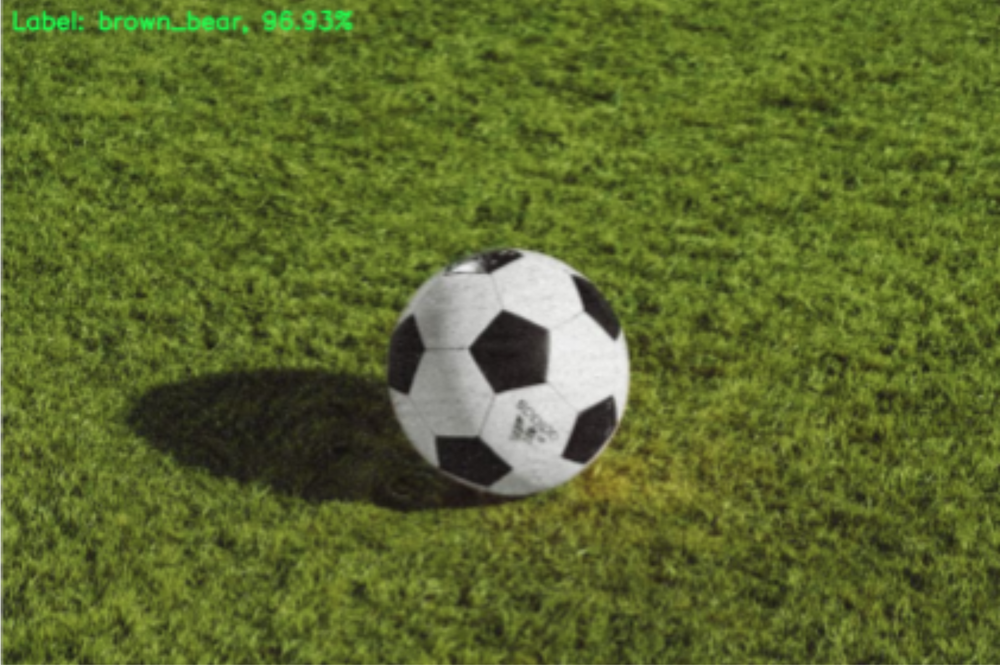

# Adversarial Image Generator

## Introduction

This project implements an algorithm for targeted, black-box adversarial attacks on image recognition. The algorithm targets a pre-trained VGG16 model, which was trained using the ImageNet database. This is done using a version of the genetic algorithm, which doesn't depend on backpropagation for optimization. 

A standard implementation of the genetic algorithm involves 3 major phases; selection, crossover, and mutation. It begins by generating an initial population and then repeating the 3 major phases, with a new population being created each iteration. The core of the algorithm is its fitness function, which is a function that measures the “quality” of an example, in terms of the metrics we are looking for in the optimal solution.

## Implementation

The three phases of the genetic algorithm were implemented as follows:
- For the selection phase, use a random k-way tournament to select two unique individuals from the current population. A random sample of k is extracted from the population, and the most-fit individual from this sample is the winner of the tournament.

- In the crossover phase, create two new individuals, or “children” from the two parents. This is done by creating a boolean matrix with the same dimensions as the original image, with half of the entries in the matrix set to True and the other half to False. This boolean matrix is used to split the parent noise vectors in half, and then create two children by recombining the halves.

- Finally, in the mutation phase, randomly edit some of the values of the new children vectors, based on a mutation chance. The mutation chance is initially set to 1.0, but decreases dynamically as the algorithm runs. Mutations are implemented by halving the values in the noise vector with a magnitude greater than twice the current standard deviation or *sigma* (σ). The remaining non-zero values are set to zero, and the zero values are replaced with a random new noise value.

## Example

Using an image of a soccer ball as our “original'' image, and an image of a brown bear as the “target”, the algorithm can create an image that looks like a soccer ball but gets classified as a brown bear by the VGG16 model. The following example instance prompts the classifier to give a confidence level of 96.9% that the image is of a brown bear, while having a mean-squared error of 199.9 (based on RGB pixel value) from the original soccer ball image.

    

  
